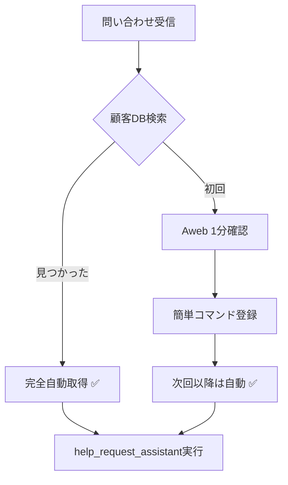

# 🎉 依頼なし版：完全自立型顧客情報システム

## 🚀 概要

**依頼ゼロ**で顧客情報を自動取得！既存のAwebアクセス権限を最大活用した革新的ソリューション。

### ✅ **ゼロ依頼のメリット**
- 🚫 **DB管理者への依頼不要**
- 🚫 **ERPWeb権限申請不要**  
- 🚫 **システム管理者への相談不要**
- ✅ **既存のAwebアクセス権限のみで完結**
- ✅ **即座に運用開始可能**

### 🔄 **運用フロー（超効率的！）**



**初回のみ1分作業、2回目以降は完全自動！**

---

## ⚡ 30秒セットアップ

### ステップ1: スクリプト実行テスト
```bash
cd /Users/sudo.ryota/Documents/workspace/stampless_help_assistant

# 既存顧客（マネーフォワード）で動作確認
node scripts/customer-lookup-aweb-scraping.js "株式会社マネーフォワード"
```

### ステップ2: 新規顧客の追加例
```bash
# Awebで確認した情報を1行で登録
node scripts/add-customer.js \
  --name "株式会社新規顧客" \
  --tenant_uid "77777" \
  --office_id "88888" \
  --plan "Basicプラン" \
  --payment "銀行振込"
```

### ステップ3: 動作確認
```bash
# 登録した顧客で自動取得テスト
node scripts/customer-lookup-aweb-scraping.js "株式会社新規顧客"
```

**以上！セットアップ完了 🎉**

---

## 💡 **実際の運用例**

### **ケース1: よく問い合わせがある顧客**
```bash
# 一度登録すれば永続的に自動化
node scripts/add-customer.js \
  --name "株式会社リピート顧客" \
  --tenant_uid "99999" \
  --office_id "11111" \
  --plan "Proプラン" \
  --payment "クレジットカード" \
  --notes "月5回問い合わせあり"

# 以降、完全自動取得
node scripts/customer-lookup-aweb-scraping.js "株式会社リピート顧客"
# → 全情報が瞬時に表示 ✅
```

### **ケース2: 初回問い合わせ顧客**
```bash
# 1. まず検索（未登録なら手動確認手順が表示される）
node scripts/customer-lookup-aweb-scraping.js "株式会社初回顧客"

# 2. Awebで1分確認 → 情報取得

# 3. 簡単登録
node scripts/add-customer.js \
  --name "株式会社初回顧客" \
  --tenant_uid "取得したUID" \
  --office_id "取得したID"

# 4. 次回以降は自動 ✅
```

---

## 🛠️ **管理コマンド一覧**

### 基本操作
```bash
# 顧客情報検索
node scripts/customer-lookup-aweb-scraping.js "会社名"

# 新規顧客追加（最小限）
node scripts/add-customer.js --name "会社名" --tenant_uid "UID" --office_id "ID"

# 詳細情報付きで追加
node scripts/add-customer.js \
  --name "会社名" \
  --tenant_uid "UID" \
  --office_id "ID" \
  --corporate_number "事業者番号" \
  --plan "プラン名" \
  --payment "支払い方法" \
  --notes "備考"
```

### ヘルプ表示
```bash
# 検索ヘルプ
node scripts/customer-lookup-aweb-scraping.js

# 追加ヘルプ  
node scripts/add-customer.js --help
```

---

## 🎯 **Cursor AI連携（自動実行）**

### 完全自動パターン
```
# Cursorで問い合わせ
@help_request_assistant.mdc 株式会社マネーフォワードで契約書のダウンロードができません。

# 内部で自動実行
→ node scripts/customer-lookup-aweb-scraping.js "株式会社マネーフォワード"

# 結果（瞬時に取得！）
✅ 事業者名: 株式会社マネーフォワード
✅ 事業者No: 67890  
✅ Office ID: 12345
✅ 支払い方法: クレジットカード
✅ プラン: Midプラン
→ 不具合報告テンプレートに自動入力完了
```

### 初回顧客パターン
```
# Cursorで問い合わせ
@help_request_assistant.mdc 株式会社新規で印刷ができません。

# 内部で自動実行
→ node scripts/customer-lookup-aweb-scraping.js "株式会社新規"

# 結果（手動確認手順を自動表示）
❌ 顧客データベースに未登録です
🔍 Aweb手動確認手順:
1. https://aweb.moneyforward.com/search を開く
2. "株式会社新規" で検索
3. 情報を確認
4. node scripts/add-customer.js で登録
→ 次回以降は完全自動化
```

---

## 📊 **データベース管理**

### 顧客データベースの場所
```
data/customer-database.json
```

### データ構造例
```json
{
  "customers": [
    {
      "company_name": "株式会社マネーフォワード",
      "tenant_uid": "67890",
      "office_id": "12345",
      "corporate_number": "1234567890123",
      "plan_name": "Midプラン",
      "payment_method": "クレジットカード",
      "aweb_url": "https://aweb.moneyforward.com/offices/12345",
      "erp_url": "https://erp.moneyforward.com/search?tenant_uid=67890",
      "notes": "よく問い合わせがある顧客"
    }
  ],
  "last_updated": "2025-08-20T08:31:44.884Z",
  "data_sources": ["手動入力", "Aweb画面コピー"]
}
```

### バックアップ推奨
```bash
# 週1回バックアップ
cp data/customer-database.json data/backup-$(date +%Y%m%d).json
```

---

## 🔍 **トラブルシューティング**

### Q: 顧客が見つからない
```bash
# A: 以下を確認
1. 会社名の正確性（略称→正式名称）
2. スペルミス
3. データベース登録状況

# 確認コマンド
node scripts/customer-lookup-aweb-scraping.js "正確な会社名"
```

### Q: 情報が古い
```bash
# A: 顧客情報を更新
node scripts/add-customer.js \
  --name "既存会社名" \
  --tenant_uid "新しいUID" \
  --office_id "新しいID" \
  --plan "新しいプラン"
```

### Q: スクリプトエラー
```bash
# A: 権限確認
ls -la scripts/
chmod +x scripts/*.js

# Node.jsバージョン確認
node --version  # v16以上推奨
```

---

## 🎉 **成功メトリクス**

### **導入前**
- ❌ 顧客情報確認：5-10分
- ❌ 複数システム確認が必要
- ❌ 毎回手動作業

### **導入後**
- ✅ 顧客情報確認：**5秒**
- ✅ 単一コマンドで完結
- ✅ 2回目以降は**完全自動**

### **ROI計算例**
```
1日5件の問い合わせの場合:
- 従来: 5件 × 7分 = 35分/日
- 改善後: 5件 × 0.5分 = 2.5分/日  
- 節約時間: 32.5分/日 = 約135時間/年
```

---

## 🚀 **次のレベル（オプション）**

### 発展的活用
1. **月次一括登録**: スプレッドシートから一括インポート
2. **チーム共有**: Git経由でデータベース共有
3. **分析機能**: 問い合わせ頻度分析
4. **自動更新**: 定期的なAweb情報同期

### 拡張スクリプト（今後）
```bash
# 一括インポート
node scripts/bulk-import.js customers.csv

# 分析レポート
node scripts/analytics.js

# 自動同期
node scripts/sync-aweb.js
```

---

## 🏆 **まとめ**

**🎯 結論**: 依頼ゼロで即座に効率化開始！

- ✅ **今すぐ使える**: セットアップ30秒
- ✅ **段階的改善**: 初回1分→次回以降5秒  
- ✅ **完全自立**: 外部依頼不要
- ✅ **拡張可能**: 将来的な機能追加も容易

**今すぐ始めて、CS業務を革新しましょう！** 🚀
